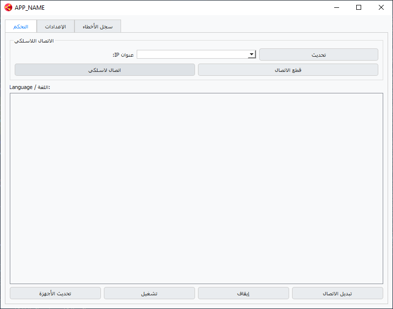
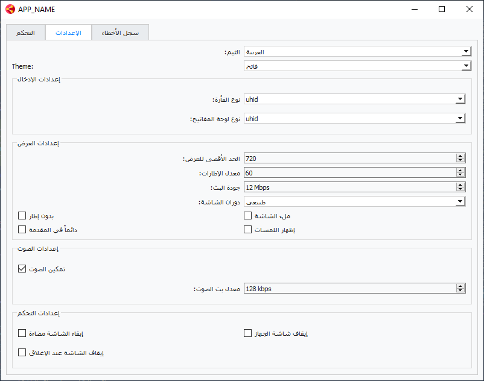

# Scrcpy Manager

Scrcpy Manager is an advanced GUI for managing and displaying Android devices on your PC using scrcpy and adb, with full support for wireless connection and customizable display, audio, and input settings.

---

## Features
- List and manage Android devices via USB or WiFi.
- Full control over display settings (size, FPS, bitrate, rotation, fullscreen, borderless, etc).
- Audio settings (enable audio, bitrate).
- Input settings (mouse and keyboard type).
- Control settings (stay awake, turn screen off, power off on close).
- Error log and notifications.
- Switch connection between USB and WiFi.
- Professional Arabic UI.

---

## Requirements
- Python 3.10+
- Libraries: PyQt5, Pillow, PyInstaller
- scrcpy and adb files (in scrcpy folder)

Install requirements:
```powershell
pip install pyqt5 pillow pyinstaller
```

---

## How to Run
1. Ensure scrcpy and adb files are in the `scrcpy` folder.
2. Run:
```powershell
python main.py
```

---

## How to Build Executable
Run build.py:
```powershell
python build.py
```
Executable will be in `dist/ScrcpyManager.exe`.

---

## Project Structure
- main.py: Main UI and app logic.
- config.py: Configuration and paths.
- threads.py: Background process management.
- ui_components.py: UI components.
- build.py: Build script.
- assets/: Icons and images.
- scrcpy/: Required scrcpy and adb files.

---

## Screenshots





---

## License
All source files are free to modify and use for personal purposes.

---

# مدير Scrcpy

برنامج Scrcpy Manager هو واجهة رسومية متقدمة لإدارة وعرض أجهزة الأندرويد على الكمبيوتر باستخدام scrcpy و adb، مع دعم كامل للاتصال اللاسلكي والتحكم في إعدادات العرض والصوت والإدخال.

---

## الميزات الرئيسية
- عرض أجهزة الأندرويد المتصلة عبر USB أو WiFi.
- التحكم الكامل في إعدادات العرض (الحجم، معدل الإطارات، جودة البث، الدوران، ملء الشاشة، بدون إطار، إلخ).
- إعدادات الصوت (تمكين الصوت، معدل البت).
- إعدادات الإدخال (نوع الفأرة ولوحة المفاتيح).
- إعدادات التحكم (إبقاء الشاشة مضاءة، إيقاف الشاشة، إيقاف الشاشة عند الإغلاق).
- سجل للأخطاء والتنبيهات.
- دعم تحويل الاتصال من USB إلى WiFi والعكس.
- واجهة مستخدم عربية احترافية.

---

## المتطلبات
- Python 3.10 أو أحدث
- مكتبات: PyQt5, Pillow, PyInstaller
- ملفات scrcpy و adb (موجودة في مجلد scrcpy)

لتثبيت المتطلبات:
```powershell
pip install pyqt5 pillow pyinstaller
```

---

## طريقة التشغيل
1. تأكد من وجود ملفات scrcpy و adb في مجلد `scrcpy`.
2. شغّل البرنامج عبر:
```powershell
python main.py
```

---

## طريقة البناء كملف تنفيذي
شغّل ملف build.py:
```powershell
python build.py
```
سيتم إنشاء ملف تنفيذي في مجلد dist باسم ScrcpyManager.exe.

---

## بنية المشروع
- main.py: الواجهة الرئيسية وإدارة التطبيق.
- config.py: إعدادات ومسارات البرنامج.
- threads.py: إدارة العمليات في الخلفية.
- ui_components.py: مكونات واجهة المستخدم.
- build.py: بناء البرنامج كملف تنفيذي.
- assets/: أيقونات وصور.
- scrcpy/: ملفات scrcpy و adb المطلوبة.

---

## صور البرنامج


---

## حقوق الاستخدام
جميع الملفات البرمجية قابلة للتعديل والاستخدام الشخصي.
